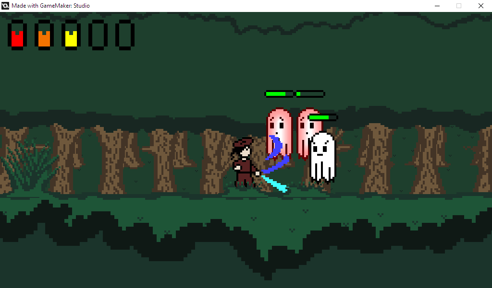

# CS1 Project
A very old (2016) and very simple game I made
Unfortunately, GameMaker Studio 1.4 is no longer supported (nor are licenses being sold).

I created all the graphics and code, but the sounds were generated using a website.

Here a readme using the original information I wrote out.

## Files

The .exe file is a compiled version of the game.
the .gmz file is a compressed Game Maker Studio project that can be opened with the Game Maker Studio 1 software (free).
The .gmz file contains all of the sprites/audio/objects etc.

### To inspect the .gmz file

With Game Maker Studio installed, import (not open) the .gmz file.
When the file is open, the left side of the screen will show a hierarchical view of the game components.
To view the code for an object such as the player, find the object on the left side of the screen and double-click to open the properties window.
The properties window has 2 sections labeled 'Events' and 'Actions,' clicking an event will show its actions (I only used code actions).
Double-clicking a code action will open the code editor to actually view the code.

### Inspecting code without GameMaker Studio
Code can also be inspected with a simple text editor, as GameMaker uses XML to store object data.

e.g.

https://github.com/dexyr/CS1-Project/blob/5b889c9fd187cf8f8bed1b59b6c468d05f2019f6/objects/obj_player.object.gmx#L53-L111

## Misc. coding notes

I used some inheritance for expandability, in order to see the parent of a given object, check the left side of the properties window for that object.
(For example, the obj_player class inherits from the obj_char class).
Game Maker inherits all events/actions from the parent object unless an event has been added to the child object, in which case the parent event must be called with event_inherited().

Since Game Maker lacks the ability to write functions in an object, I created some scripts (under the scripts section of the hierarchy).
The scripts I created were mostly to handle some interactions with arbitrary objects (for example, creating hitboxes/projectiles whenever a given attack is called).
I also use some scripts as psuedo-constructors for animation objects/attack objects.
Making arbitrary animation/attack objects allowed me to define animations/attacks in the create event of objects such as the player and ghost rather than editing the code for every new enemy type.
I didn't create more enemy types, but this system would allow easy expandability if I had the time or do continue to work on this game.

## Controls

A and D (from WASD) for left/right movement
Spacebar to jump
Left arrow to fire the bow
Down arrow to swing the sword

## Combat

Player health is represented in the upper-left corner with vials.
Enemy health is displayed when an enemy has been recently hit.

Player and enemies are stunned if hit by attacks, and recieve immunity to all subsequent attacks for a short amount of time.
Ghosts will not chase the player until the player is nearby (or the player shoots a projectile at them).

The ghost's projectiles can be destroyed by the player's sword if swung at the right time.

The ghost's projectiles can be dodged by jumping over them (Jumping has a 2-frame startup, so jump a little early).

If you are defeated, the game is lost, but if you defeat all ghosts on the map then the game is won.

